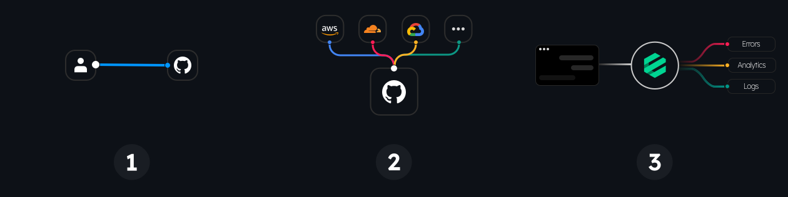

  <h3><strong>Fine-grained control over analytics events and logs</strong></h3>

  <small>Govern, transform, filter, and route your logs & analytics events to multiple destinations from your applications
via remote configuration.</small>

  <h3>
    <a href="https://eventvisor.org">
      Website
    </a>
     | 
    <a href="https://eventvisor.org/docs">
      Documentation
    </a>
     | 
    <a href="https://github.com/eventvisor/eventvisor/issues">
      Issues
    </a>
     | 
    <a href="https://eventvisor.org/docs/contributing">
      Contributing
    </a>
     | 
    <a href="https://github.com/eventvisor/eventvisor/blob/main/CHANGELOG.md">
      Changelog
    </a>
  </h3>

---

## How does it work?

Three simple steps to visualize it:

1. Manage your Eventvisor [project](https://eventvisor.org/docs/projects) in a Git repository
1. Build and upload [datafiles](https://eventvisor.org/docs/building-datafiles) (static JSON files) to your CDN or custom server
1. Fetch the datafile, and start tracking events with the [SDK](https://eventvisor.org/docs/sdks/javascript)

## What do I need to use Eventvisor?

- A Git repository for managing your [project](https://eventvisor.org/docs/projects) declaratively
- A CI/CD pipeline (like [GitHub Actions](https://eventvisor.org/docs/deployment/github-actions)) for building and uploading the [datafiles](https://eventvisor.org/docs/building-datafiles)
- A CDN or custom server for serving the generated [datafiles](https://eventvisor.org/docs/building-datafiles)

Eventvisor [SDKs](https://eventvisor.org/docs/sdks/javascript) will take care of the rest for you.

## Why should I use Eventvisor?

There are several use cases where Eventvisor can be useful, especially if you are a medium to large product engineering organization:

- [Governance of analytics events](https://eventvisor.org/docs/use-cases/governance/)
- [Conditionally routing events to different vendors](https://eventvisor.org/docs/use-cases/routing/)
- [Migrating from one vendor to another with ease incrementally](https://eventvisor.org/docs/use-cases/migrating-vendors/)
- [Validation warnings for tracking events in wrong shapes](https://eventvisor.org/docs/use-cases/validation/)
- [Deprecating events safely for multiple teams](https://eventvisor.org/docs/use-cases/deprecation/)
- [Bringing order in a microfrontends architecture](https://eventvisor.org/docs/use-cases/microfrontends/)
- [Saving data ingestion costs via advanced filtering and sampling](https://eventvisor.org/docs/use-cases/saving-ingestion-costs/)
- [Marketing pixels with engineering oversight](https://eventvisor.org/docs/use-cases/marketing-pixels/)

Visit the website to learn more: https://eventvisor.org

## License

MIT © [Fahad Heylaal](https://fahad19.com)
